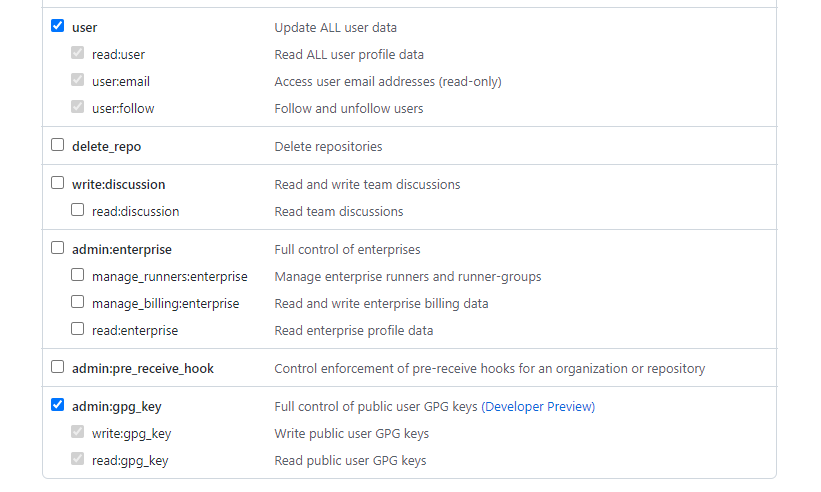

# Description
The programm creates a newly GPG key according to the [GitHub Website](https://docs.github.com/en/authentication/managing-commit-signature-verification/generating-a-new-gpg-key).
For signing you need a RSA 4096 GPG key and a RSA 4096 sub-key. The name and eMail have to be the same as in GitHub.
The expiry date is hardcoded and the newly GPG key is only valid for two years.
**Attention:** The final configuration is automatically saved to the global GIT config and can then be used by Eclipse.

# Usage
## Token generation
A special kind of token has to be generated (see: https://github.com/settings/tokens/new).

The only selected scopes are for *user* and *admin:gpg_key*.

This token has to have a very short lifetime (you need it only to generate the GPG key) and it should be a newly generated token only for this purpose.

## Start the programm
The program should run on the commandline and from every IDE you use, as long as GPG and GIT are installed.
In the moment two arguments has to be set:
* The newly generated token
* The passphrase for the GPG key

# TODO:
* The expiry date for the GPG key should be set by the user.
* Frontend for generation
* Automatically find GPG and GIT on Linux, Mac and Windows systems

# Inspired by 
* https://github.com/wimtie/gpg-java
* https://github.com/hub4j/github-api
